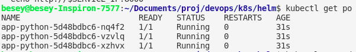

# Create secret

To generate secret, run the following command:
```
kubectl create secret generic my-secret --from-literal username=admin --from-literal password=qwerty
```
# Check and decode secret

To view the contents of the created secret, run the following command:
```
kubectl get secret my-secret -o jsonpath='{.data}'

```
# After creating secret.yaml file and adding env field in Deployment, run the following commands:



# Setting up memory limits for resources and requests
## Really small limits causes CreateContainerError because it's not enough memory for the application


## Everything works fine with another values


