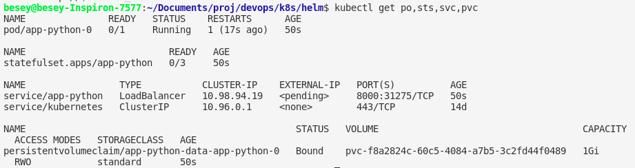
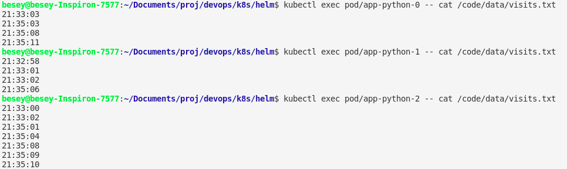

# StatefulSet
Output for ``` kubectl get po,sts,svc,pvc ```


Access the page several time and I got this result:

The data is different for pods, for each pod there is a volume with a volume.txt file inside and these volumes are independent. 

## Order guarantee
For our app ordering guarantee is unnecessary, because deployments of pods do not depend on each other. I decided to use podManagementPolicy to run pods in parallel.