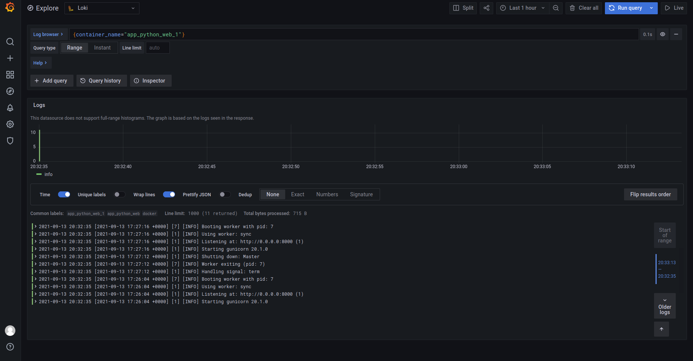
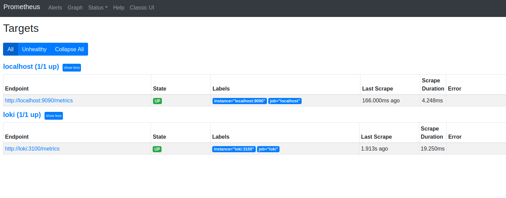
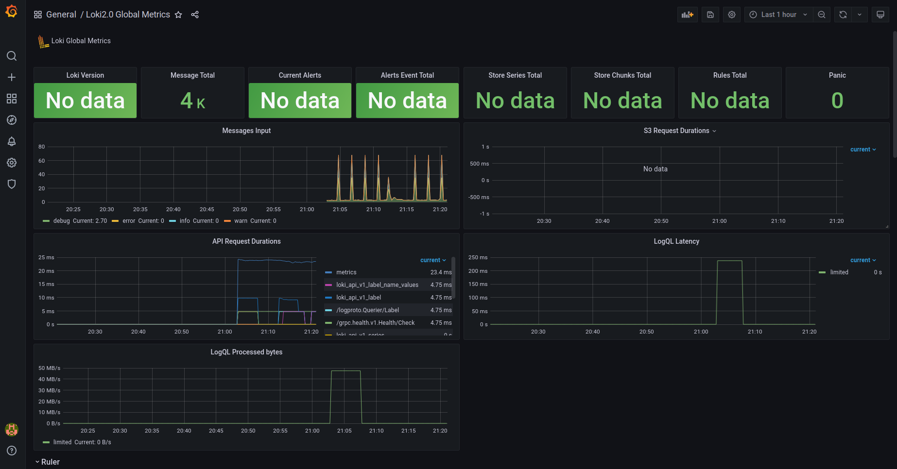

# Proofs:

Configure Prometheus

Using Grafana dashboards

## Best practices using Promtail, Loki, Grafana
1. Establish limits for logging and log file rotation 
2. Define tags meaningfully
3. The applications should not create unmeaningful logs and fill in all storage. (Also it's not free for such mess) 